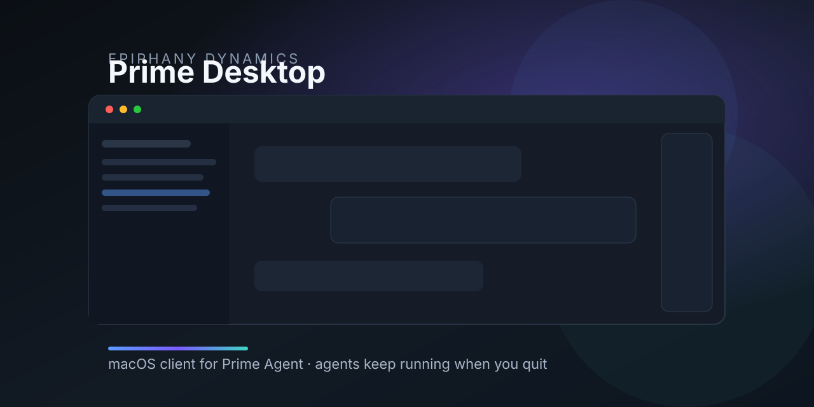

<p align="center">
  
</p>

<p align="center">
  <strong>Native macOS desktop client for <a href="https://primeintellect.ai">Prime Agent</a></strong><br>
  Early public macOS build · multi-pane chats · live attach · Agents panel<br>
  Built by <a href="https://epiphanydynamics.ai">Epiphany Dynamics</a>
</p>

<p align="center">
  <a href="https://github.com/epiphany-dynamics/prime-desktop/releases"></a>
  <a href="LICENSE"></a>
  <a href="docs/INSTALL.md"></a>
  <a href="https://www.electronjs.org/"></a>
  <a href="https://epiphanydynamics.ai"></a>
</p>

<p align="center">
  <a href="docs/INSTALL.md"><strong>Install guide</strong></a> ·
  <a href="docs/TROUBLESHOOTING.md"><strong>Troubleshooting</strong></a> ·
  <a href="CHANGELOG.md"><strong>Changelog</strong></a> ·
  <a href="PARITY.md"><strong>Feature status</strong></a> ·
  <a href="https://github.com/epiphany-dynamics/prime-desktop/issues"><strong>Issues</strong></a>
</p>

---

> **Early public build.** macOS only. Needs [Prime Agent](https://github.com/PrimeIntellect-ai/prime-agent). The download is **unsigned** until Apple signing is ready — Gatekeeper will warn. Read [docs/KNOWN_LIMITS.md](docs/KNOWN_LIMITS.md) before you share this widely.

## Why Prime Desktop

Prime Agent is excellent in the terminal. **Prime Desktop** gives it a real Mac UI without taking ownership of the agent process.

| You get | Why it matters |
|---|---|
| Two chats side by side | Compare, babysit, or steer two lines of work |
| Attach to live agents | Join a session already running in the terminal/daemon |
| **Quit without killing agents** | Close the window; workers keep going; reopen and reattach |
| Project folders + file tree | Point a chat at a repo; browse and attach files safely |
| Image paste + file chips | Drop context in without fighting the terminal |
| Agents dashboard | See live workers and child sessions |
| Floating HUD | Lightweight always-on-top view |

No voice features. That is a product rule, not a missing checkbox.

---


## Download the Mac app (unsigned)

1. Open the latest [GitHub Release](https://github.com/epiphany-dynamics/prime-desktop/releases)
2. Download the **arm64 zip** (Apple Silicon)
3. Unzip → right-click **Prime Agent.app** → **Open** (Gatekeeper)
4. Install Prime Agent if needed: `curl -fsSL https://app.primeintellect.ai/prime-agent/install.sh | sh`

Intel Macs: run from source for now.

## Install in 2 minutes

**Option A — from source (recommended for builders)**


### 1. Install Prime Agent (the brain)

```bash
curl -fsSL https://app.primeintellect.ai/prime-agent/install.sh | sh
prime-agent --version
```

### 2. Run Prime Desktop (this app)

```bash
git clone https://github.com/epiphany-dynamics/prime-desktop.git
cd prime-desktop
npm install
npm run doctor
npm start
```

### 3. First session

1. **Prime → Install or Repair Agent…** if doctor said the agent is missing  
2. **Cmd+O** → choose a project folder  
3. Type a message → Enter  
4. Optional: complete provider login in **Settings** (or run `prime-agent` once and `/login`)

<details>
<summary><strong>Put a local .app in Applications</strong> (unsigned early build)</summary>

```bash
./scripts/install-prime-desktop.sh
```

macOS may Gatekeeper-block unsigned apps → right-click → **Open**.  
Full notes: [docs/INSTALL.md](docs/INSTALL.md) · [Known limits](docs/KNOWN_LIMITS.md)

</details>

---

## Demo checklist (stranger-safe)

After `npm start`:

- [ ] Empty state shows three setup steps  
- [ ] Settings opens; API keys are write-only (never shown back in full)  
- [ ] Choose Project sets the folder under the composer  
- [ ] Sending a message streams a reply when the agent + provider are configured  
- [ ] Sidebar session click stays **one** pane (Split only from the Split control)  
- [ ] Quit app → `prime-agent agents` still lists live work → reopen Desktop and reattach  

---

## Verify without API keys

```bash
npm test          # unit tests
npm run smoke     # protocol + fake agent
npm run ui-smoke  # real Electron windows (macOS)
npm run doctor    # environment check
```

This org does **not** use GitHub Actions on this repo. **Your machine is the CI.** Run the commands above before PRs.

---

## Feature snapshot

See the full matrix in [`PARITY.md`](PARITY.md).

**Solid today**

- Split View (2 panes), pop-outs, shared live sessions  
- Daemon attach for Prime Agent 0.7 resident workers  
- Detach-on-quit for process and daemon clients  
- Projects, git branch/worktree identity, safe file explorer  
- Attachments (images + local file/folder/session refs)  
- HUD, schedules/heartbeats entry points, capabilities panel  
- Agents dashboard (live / children / related)  
- Sandboxed renderer + tight IPC  

**Not yet / on purpose**

- Apple-signed DMG download  
- Windows / Linux  
- Session export, full git mutation UI, in-app editor  
- Voice (excluded)

---

## Architecture

```text
sandboxed UI  --tight IPC-->  Electron main  --attach-->  live daemon worker
                                   \-- RPC child -->  new / inactive session only
```

| Path | Role |
|---|---|
| `main.js` | Windows, panes, IPC, settings, HUD |
| `lib/rpc-manager.js` | Process RPC; detach-on-quit |
| `lib/daemon-rpc-adapter.js` | Non-owning Prime 0.7 attach |
| `lib/workspace-service.js` | Projects, tree, search, watch |
| `lib/attachment-service.js` | Drafts, images, file refs |
| `preload.js` | Small bridge into the UI |
| `renderer/` | Multi-pane UI |
| `scripts/` | Doctor, fake agent, smoke tests |
| `docs/` | Install, troubleshooting, roadmap |

Contract for daemon attach: [`DAEMON-ATTACHMENT.md`](DAEMON-ATTACHMENT.md).

---

## Security

- No API keys or machine paths are stored in this git repo  
- GitHub **secret scanning + push protection** are on for this repository  
- Keys in the app are write-only after save  
- Sensitive paths cannot be attached as files  

Report issues privately: [`SECURITY.md`](SECURITY.md) · **security@epiphanydynamics.ai**

---

## Contributing & support

- [CONTRIBUTING.md](CONTRIBUTING.md) — setup, rules, PR bar  
- [CODE_OF_CONDUCT.md](CODE_OF_CONDUCT.md)  
- [SUPPORT.md](SUPPORT.md)  
- [docs/ROADMAP.md](docs/ROADMAP.md)  
- [CHANGELOG.md](CHANGELOG.md)

---

## About Epiphany Dynamics

We build production AI systems and sharp open tools.

- Web: [epiphanydynamics.ai](https://epiphanydynamics.ai)  
- GitHub: [github.com/epiphany-dynamics](https://github.com/epiphany-dynamics)  
- This repo: [github.com/epiphany-dynamics/prime-desktop](https://github.com/epiphany-dynamics/prime-desktop)

If Prime Desktop helps you, a star helps others find it — and helps Epiphany Dynamics keep shipping.

---

## License

[MIT](LICENSE) © [Epiphany Dynamics](https://epiphanydynamics.ai)

Prime Desktop is an independent client. “Prime Agent” and “Prime Intellect” names belong to their owners. See [`NOTICE`](NOTICE).
